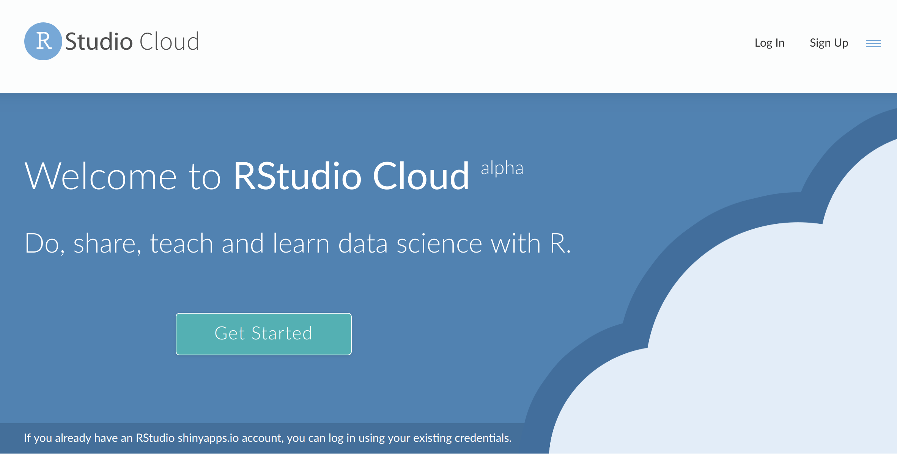
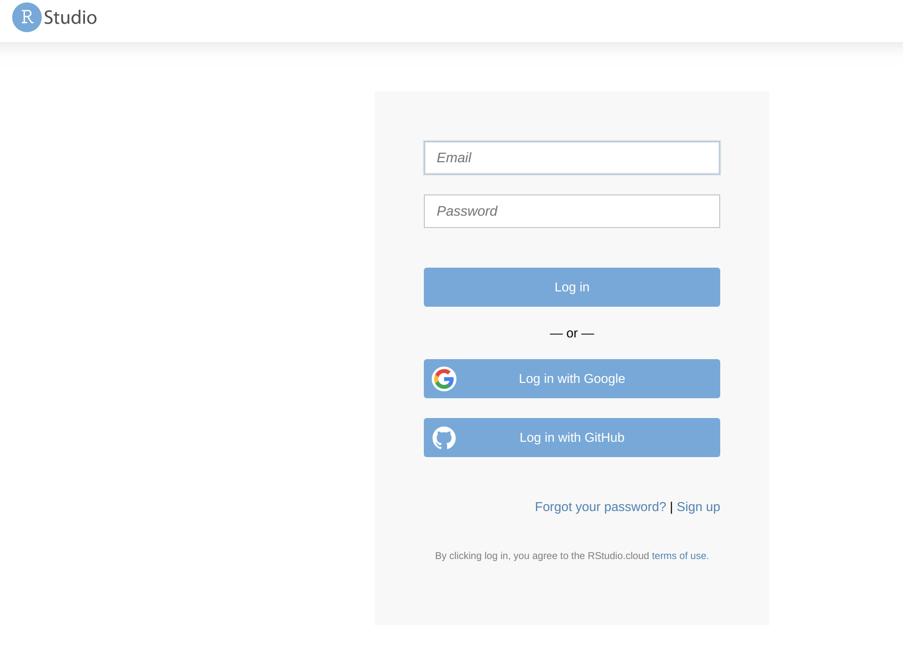
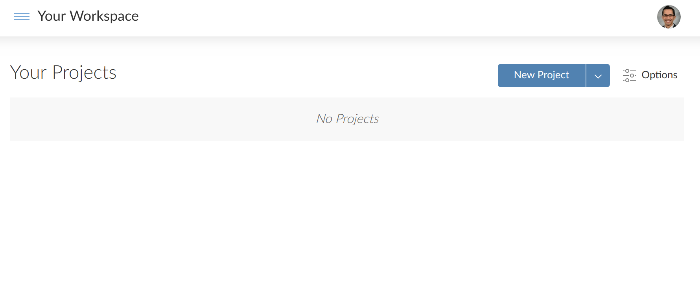
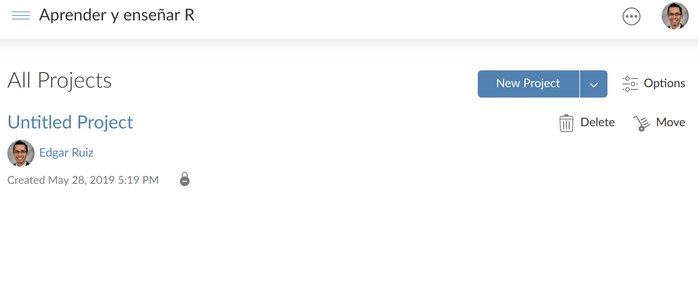

class: dark, middle, center
# Instalar y usar R

---
class:regular
# Requerimientos

--
* Bajar R de internet

--
* Instalar R

--
* Bajar RStudio de internet

--
* Instalar RStudio

---
class:regular
# RStudio Cloud

--
* Registrarse en el sitio: *rstudio.cloud*

--
* Empezar a usar

---
class: exercise, middle, center
# Inscribirse en **rstudio.cloud**
## Ejercicio 2-1

---
class: regular
### Vaya a *rstudio.cloud*, click en **Login**

```{r, echo = FALSE, fig.align = "center", out.width = 800}

```

---
class: regular
### Seleccione *Google*, o una alternativa

```{r, echo = FALSE, fig.align = "center", out.width = 650}

```

---
class: regular
### Seleccione la cuenta que desea usar

```{r, echo = FALSE, fig.align = "center", out.width = 650}
knitr::include_graphics("include/02-choose-account.png")
```

---
class: regular
### Tiene acceso a sus proyectos

```{r, echo = FALSE, fig.align = "center", out.width = 900}

```

---
class: exercise, middle, center
# Unirse al espacio de trabajo
## Ejercicio 2-2

---
class: regular
### Navegue a *rstd.io/aprender*

```{r, echo = FALSE, fig.align = "center", out.width = 800}

```

---
class: exercise, middle, center
# Acceder datos
## Ejercicio 2-2
### **Archivo:** 02-2-librerias.R
