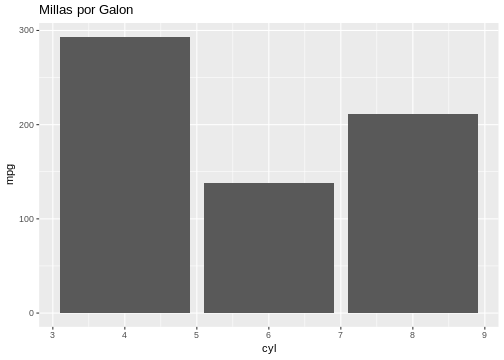

---
output:
  xaringan::moon_reader:
    css: "include/aprender.css"
    seal: false
    nature:
      countIncrementalSlides: yes
      highlightLines: yes
      highlightStyle: github
      ratio: 16:9
resource_files:
  - include
---
---
class: title-slide, middle, center
# Crear gráficas
---
```{r, include = FALSE}
library(ggplot2)
```


class: dark, middle, center
# Paquete `ggplot2`

---
class: regular
# Como funciona `ggplot2`

--
* Implementa la **gramática de las gráficas** en **R**

--
* Cualquier gráfica usando: *datos, coordenadas y objetos geométricos (geoms)*

--
* Asignar variables a las **propiedades visuales** 

--
* Se programa por **capas**

---
class:regular
## Capa 1
```{r, eval = FALSE}
ggplot()
```
```{r, out.height = 400, out.width = 600, fig.align = "center", echo = FALSE}

```
---
class:regular
## Capa 2

```{r, eval = FALSE}
ggplot() + geom_col(aes(cyl, mpg), data = mtcars)
```
```{r, out.height = 400, out.width = 600, fig.align = "center", echo = FALSE}
knitr::include_graphics("include/03-capa2.png")
```
---
class:regular
## Capa 3

```{r, eval = FALSE}
ggplot() + geom_col(aes(cyl, mpg), data = mtcars) + labs(title = "Millas por Galon")
```
```{r, out.height = 400, out.width = 600, fig.align = "center", echo = FALSE}

```

---
class: exercise, middle, center
# Crear gráficas
## Ejercicio 3
### **Archivo:** 03-1-graficas.R y 03-2-graficas.R
