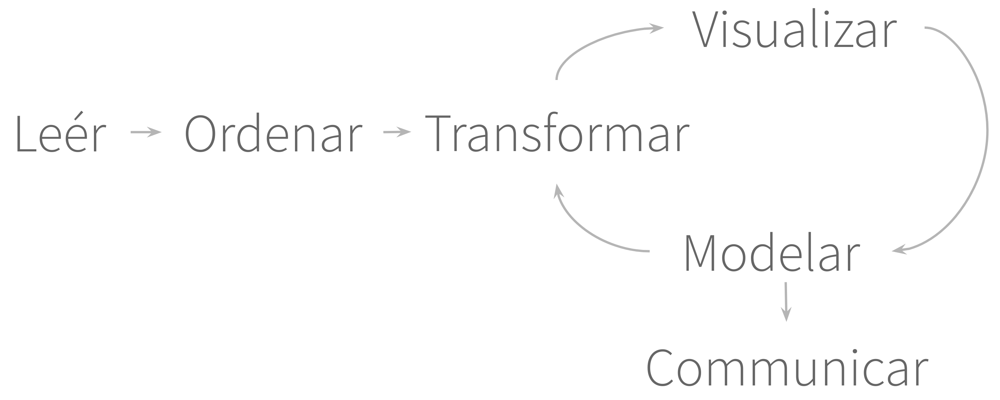
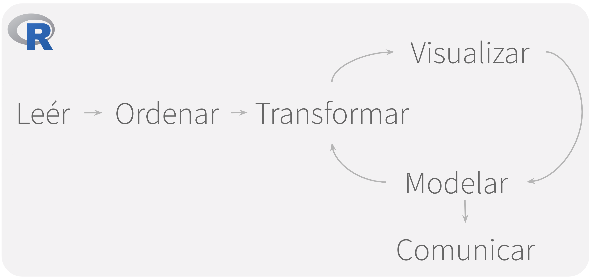
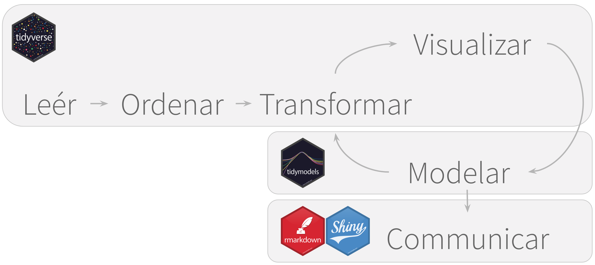
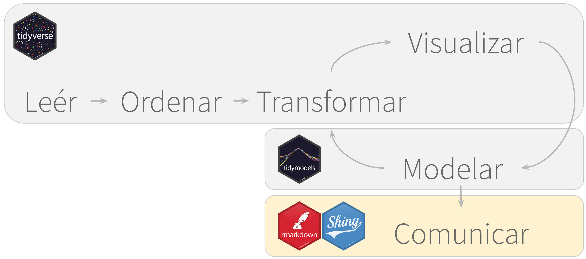

---
output:
  xaringan::moon_reader:
    css: "include/aprender.css"
    seal: false
    nature:
      countIncrementalSlides: yes
      highlightLines: yes
      highlightStyle: github
      ratio: 16:9
resource_files:
  - include
---
---
class: title-slide, middle, center
# Análisis de Datos

---
class: regular
# Pasos del análisis 

```{r, out.height = 400, out.width = 1000, fig.align = "center", echo = FALSE}

```

---
class: regular
# Todos corren en **R**

```{r, out.height = 450, out.width = 1000, fig.align = "center", echo = FALSE}

```

---
class: regular
#  **Paquetes de R** facilitan el análisis

```{r, out.height = 450, out.width = 1000, fig.align = "center", echo = FALSE}

```

---
class: title-slide, middle, center
# Comunicar con R

---
class: regular
## R Markdown

.left-column[
```{r, out.height = 300, out.width = 300, fig.align = "center", echo = FALSE}
knitr::include_graphics("include/hex/rmarkdown.png")
```
]

.right-column[
* Utiliza **bloques de código** 
* Bloques se pueden ejecutar independientemente
* **Resultados visibles** debajo del bloque.  
]

---
class: regular
# Lo que cubre el `rmarkdown` 

```{r, out.height = 450, out.width = 1000, fig.align = "center", echo = FALSE}

```

---
class: regular
# Los resultados

.left-column[
* El archivo HTML se puede compartir facilmente
* Los resultados se pueden publicar en RPubs 
]

.right-column[
```{r, out.height = 400, out.width = 500, fig.align = "center", echo = FALSE}
knitr::include_graphics("include/04-notebook-preview.png")
```
]

---
class: exercise, middle, center
## Ejercicio
# Usar R Notebooks
### **Archivo:** 04-RNotebook.Rmd
