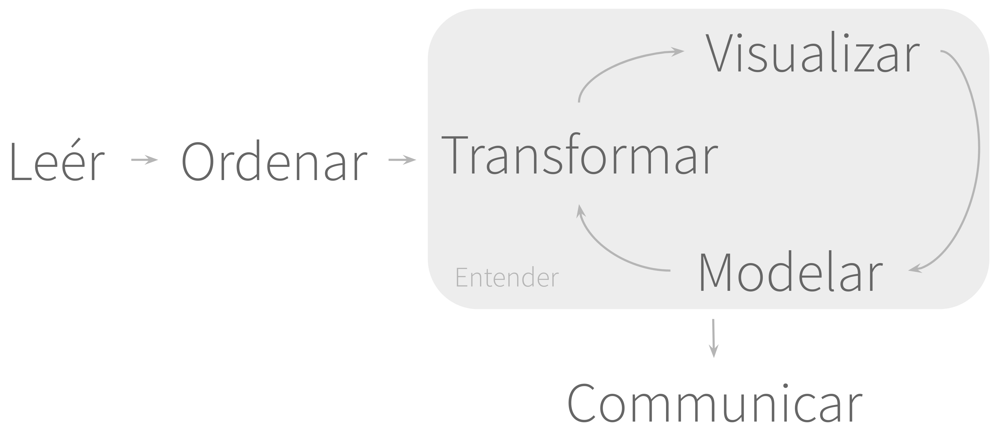
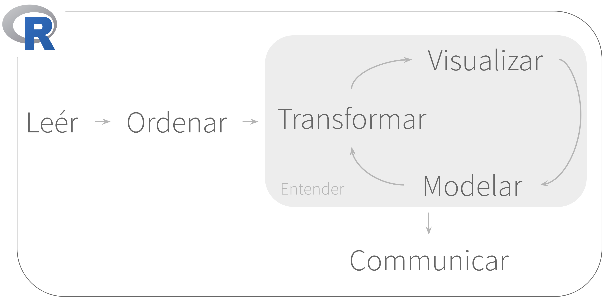

---
output:
  xaringan::moon_reader:
    css: "include/aprender.css"
    seal: false
    nature:
      countIncrementalSlides: yes
      highlightLines: yes
      highlightStyle: github
      ratio: 16:9
resource_files:
  - include
---
---
class: title-slide, middle, center
# Analizar Datos

---
class: regular
# Pasos del análisis 

```{r, out.height = 400, out.width = 950, fig.align = "center", echo = FALSE}

```

---
class: regular
# Todos corren en **R**

```{r, out.height = 400, out.width = 850, fig.align = "center", echo = FALSE}

```

---
class: regular
## El tidyverse

.left-column[
```{r, out.height = 350, out.width = 400, fig.align = "center", echo = FALSE}
knitr::include_graphics("include/05-packages.png")
```
]
.right-column[
### Una **colección de paquetes de R que son diseñados para la Ciencia de Datos**. Todos los paquetes utilizan la misma filosofía de diseño, gramática y estructuras de datos.

]

---
class: regular
## La meta del `tidyverse`

.left-column[
```{r, out.height = 350, out.width = 400, fig.align = "center", echo = FALSE}
knitr::include_graphics("include/05-meta-tidyverse.png")
```
]
.right-column[
### Resolver problemas complicados mediante la combinación de diferentes piezas que son consistentes unas con otras.
]

---
class: regular

# Leér

* `readr` - Leér o importar datos
* `jsonlite` - Leér archivos JSON
* `readxl` - Leér archivos Excel
* `rvest` - Leér el código detras the una página web
* `xml2` - Leér archivos XML

---
class: regular

# Ordenar y Transformar

* `tidyr` - Ordernar datos
* `dplyr` - Transformar datos
* `stringr` - Manejo de texto
* `lubridate` - Manejo de fechas
* `forcats` - Variables de factores

---
class: regular

# Visualizar

* `ggplot2` - Visualizar datos

# Programar

* `purrr` - Programación funcional

---
class: dark, middle, center
# Los principios del `tidyverse`

---
class: regular
## Principio #1 - Use datos *ordenados*

--
1. Cada línea es una observación

--
1. Cada columna es una variable

--

.left-column[
### No
```{r, echo = FALSE}
tibble::tribble(~fecha, ~nombre, ~mate, ~ingles, "1/1/99", "Juan Perez", 90, 60)
```
]
.right-column[
### Sí
```{r, echo = FALSE}
tibble::tribble(~mes, ~anio, ~primer, ~apellido, ~materia, ~puntos,
                  1,     99, "Juan", "Perez",    "mate",     90,
                  1,     99, "Juan", "Perez",    "ingles",   60
                )
```
]

---
class: regular
## Principio #2 – Cada función es un paso

.left-column[
#### Seleccione las calificaciones de Matemática 

#### Agrupa por cada primer nombre y apellido

#### Calcule el promedio de las calificationes 

#### Imprime los resultados 
]

.right-column[
 
 
`mate <- filter(datos, materia == "matematica")`

`alumno <- group_by(mate, primer, apellido)`

`promedio <- summarise(alumno, promedio = mean(puntos))`

`promedio`
]

---
class: regular
## Problemas con el código

--
### 1. Creamos variables que usamos solo una vez

--
### 2. Es difícil de leer, y entender, todo los pasos rápidamente.

--

 ```r
mate <- filter(datos, materia == "matematica")

alumno <- group_by(mate, primer, apellido)

promedio <- summarise(alumno, promedio = mean(puntos))

promedio
```

---
class: regular
## Principio #3 - Combine con `%>%`

--
### Antes

 ```r
mate <- filter(datos, materia == "matematica")
alumno <- group_by(mate, primer, apellido)
promedio <- summarise(alumno, promedio = mean(puntos))
promedio
```

--
### Después

```r
datos %>%
  filter(materia == "matematica") %>%
  group_by(primer, apellido) %>%
  summarise(promedio = mean(puntos))
```

---
class: regular
## Los principios del `tidyverse`

--

1. Las estructuras principales son datos ordenados

--

1. Cada función representa un paso

--

1. Las funciones se combinan con `%>%`

---
class: exercise, middle, center
# Analizar Datos con el `tidyverse`
## Ejercicio 5-1
### **Archivo:** 05-1-tidyverse.Rmd
