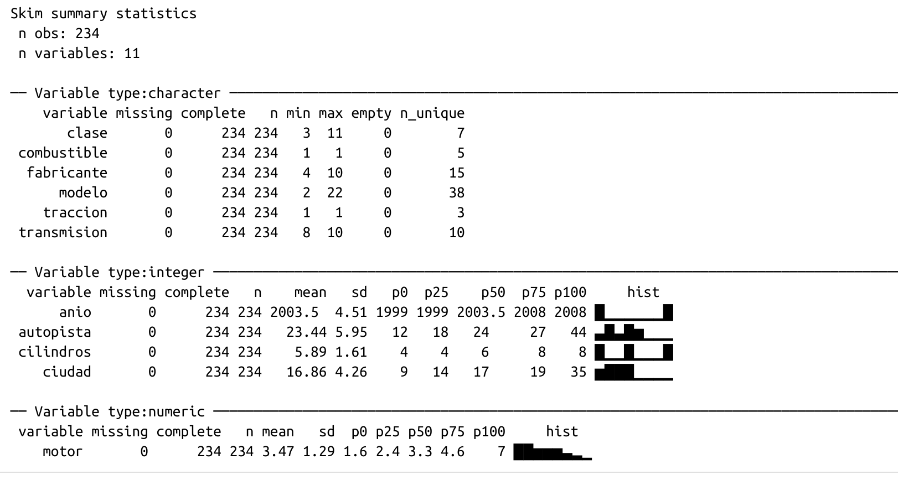
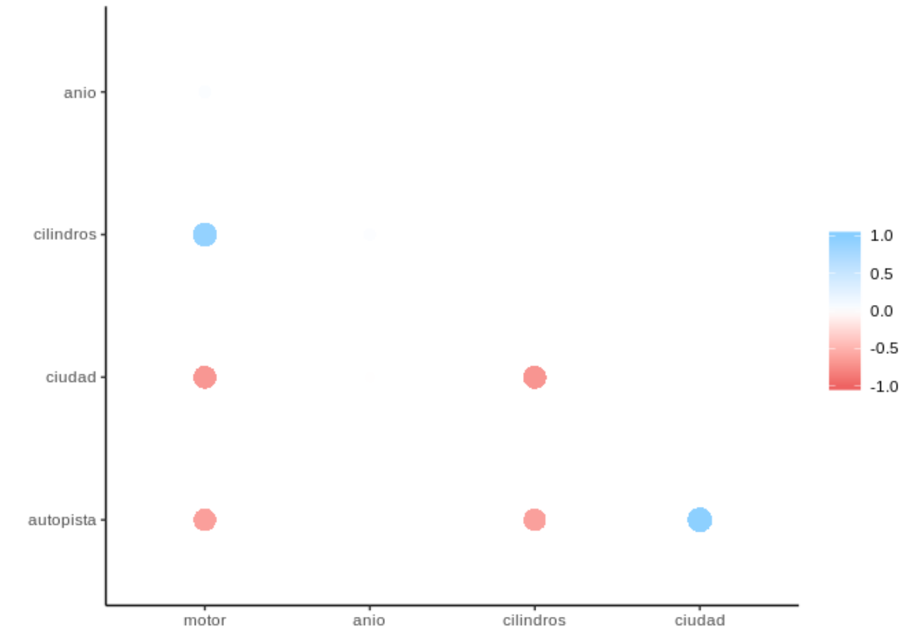
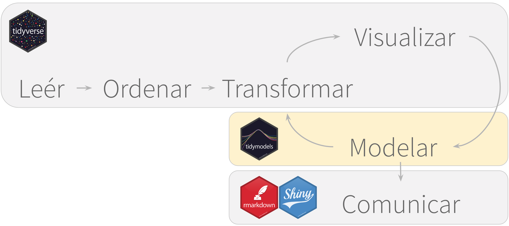
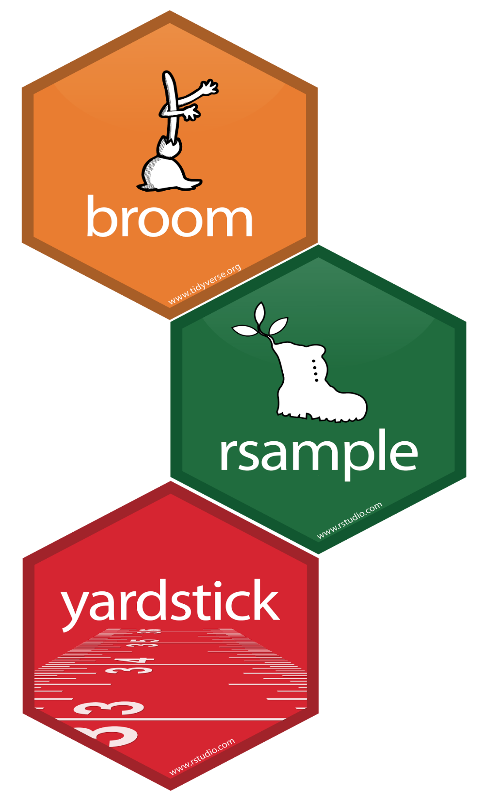
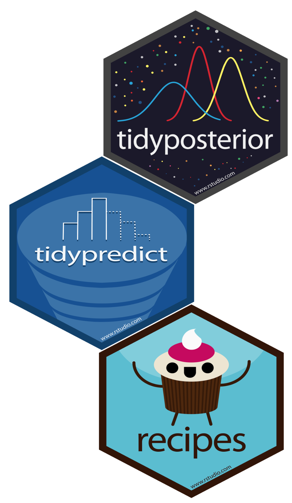

---
output:
  xaringan::moon_reader:
    css: "include/aprender.css"
    seal: false
    nature:
      countIncrementalSlides: yes
      highlightLines: yes
      highlightStyle: github
      ratio: 16:9
resource_files:
  - include
---
---
class: title-slide, middle, center
# Modelar con **R**

---
class: dark, middle, center
# Paquetes para exploración

---
# Analisis rápido con `skimr`

```{r, eval = FALSE}
library(skimr)
skim(millas) 
```
```{r, out.height = 380, out.width = 750, fig.align = "center", echo = FALSE}

```

---
# Correlaciones con `corrr`

### Paquete especializado en el manejo de correlaciones. 

.left-column[
```r
library(corrr)

millas %>% 
 select_if(is.numeric) %>%
 correlate() %>% 
 shave()  %>% 
 rplot()
```
]

.right-column[
```{r, out.height = 350, out.width = 600, fig.align = "center", echo = FALSE}

```
]

---
class: exercise, middle, center
## Ejercicio
# Analyzar `vehiculos`
### **Archivo:** 05-vehiculos.Rmd

---
class: dark, middle, center
# Introduciendo `tidymodels`

---
class: regular

#`tidymodels`

.left-column[
```{r, out.height = 300, out.width = 280, fig.align = "center", echo = FALSE}
knitr::include_graphics("include/06-tidymodels_hex.png")
```
]
.right-column[
### Conjunto de paquetes para modelamiento y análisis estadístico  
### Comparten la misma filosofía de diseño, grámatica, y estructuras que el `tidyverse`
]

---
class: regular
# Lo que cubre el `tidymodels` 

```{r, out.height = 450, out.width = 1000, fig.align = "center", echo = FALSE}

```

---
class: regular

# Paquetes del `tidymodels`

.left-column[
```{r, out.height = 400, out.width = 250, fig.align = "center", echo = FALSE}

```
]
.right-column[
* `rsample` - Para re-tomar **muestras** de datos 

* `broom` - Modelos de R en tablas ordenadas

* `yardstick` - **Evaluar** modelos

* `recipes` - Para **pre-procesar datos**

]

---
class: regular
# Paquetes del `tidymodels`

.left-column[
```{r, out.height = 400, out.width = 220, fig.align = "center", echo = FALSE}

```
]
.right-column[
* `infer` - Inferencias estadísticas

* `tidypredict` - Traduce predicciones a SQL

* `tidyposterior` - Compara modelos Bayes

* `tidytext` - Datos de texto
]

---
class: regular

# Muestra de datos con `rsample`

### `initial_split()` automáticamente divide los datos para entrenamiento y prueba.  En este caso, las 234 observaciones se dividieron en **176 para entrenamiento y 58 para prueba**.

```r
library(rsample)
partir <- initial_split(millas)
partir
```
```r
## <176/58/234>
```
---
class: regular

# Resultados de modelos

```r
modelo <- lm(ciudad ~ motor + anio, data = training(partir))
summary(modelo)
```
```r
## Call:
## lm(formula = ciudad ~ motor + anio, data = training(partir))
## Residuals:
##     Min      1Q  Median      3Q     Max 
## -6.6687 -1.3551 -0.1406  0.9770 14.2941 
## Coefficients:
##               Estimate Std. Error t value Pr(>|t|)    
## (Intercept) -130.10433   74.95257  -1.736   0.0839 .  
## motor         -2.67072    0.13070 -20.434   <2e-16 ***
## anio           0.07798    0.03744   2.083   0.0384 *  
```

---
class: regular

# Resultados ordenados con `broom`

```r
library(broom); tidy(modelo)
```
```r
##   term         estimate std.error statistic  p.value
##   <chr>           <dbl>     <dbl>     <dbl>    <dbl>
## 1 (Intercept) -130.       75.0        -1.74 8.39e- 2
## 2 motor         -2.67      0.131     -20.4  1.07e-53
## 3 anio           0.0780    0.0374      2.08 3.84e- 2
```

```r
glance(modelo)
```
```r
##   r.squared adj.r.squared sigma statistic  p.value    df  
##       <dbl>         <dbl> <dbl>     <dbl>    <dbl> <int> 
## 1     0.644         0.641  2.55      209. 1.40e-52     3 
```

---
class: regular

# Evalúe modelos con `yardstick`

```r
library(yardstick)
modelo %>%
  augment(newdata = testing(partir)) %>% 
  metrics(ciudad, .fitted)
```
```r
## # A tibble: 3 x 3
##   .metric .estimator .estimate
##   <chr>   <chr>          <dbl>
## 1 rmse    standard       2.43 
## 2 rsq     standard       0.684
## 3 mae     standard       1.80 
```
---
class: exercise, middle, center

## Ejercicio
# Modelos con `tidymodels`
### **Archivo:** 06-tidymodels.Rmd

---
class: dark, middle, center
# Modelo por sección

---
class: regular

# `group_nest()`

```r
partir %>%
  training() %>%
  group_nest(cilindros)
```
```r
## # A tibble: 4 x 2
##   cilindros data              
##       <int> <list>            
## 1         4 <tibble [58 × 10]>
## 2         5 <tibble [3 × 10]> 
## 3         6 <tibble [65 × 10]>
## 4         8 <tibble [50 × 10]>
```

---
class: regular

# `map()`

```r
partir %>%
  training() %>%
  group_nest(cilindros) %>%
  mutate(modelo = map(data, ~lm(ciudad ~ motor, data = .x)))
```
```r
## # A tibble: 4 x 3
##   cilindros data               modelo
##       <int> <list>             <list>
## 1         4 <tibble [58 × 10]> <lm>  
## 2         5 <tibble [3 × 10]>  <lm>  
## 3         6 <tibble [65 × 10]> <lm>  
## 4         8 <tibble [50 × 10]> <lm>  
```

---
class: regular
# `map()` + `unnest()` 

```r
partir %>%
  training() %>%
  group_nest(cilindros) %>%
  mutate(modelo = map(data, ~lm(ciudad ~ motor, data = .x)),
         resultados = map(modelo, glance)) %>%
  unnest(resultados)
```
```r
##   cilindros data          modelo r.squared adj.r.squared sigma
##       <int> <list>        <list>     <dbl>         <dbl> <dbl>
## 1         4 <tibble [58 … <lm>      0.236        0.222   3.23
## 2         5 <tibble [3 ×… <lm>      0            0       0.577
## 3         6 <tibble [65 … <lm>      0.290        0.279   1.42
## 4         8 <tibble [50 … <lm>      0.0218       0.00141 1.65
```
---
class: exercise, middle, center
## Ejercicio
# Modelos por segmentos
### **Archivo:** 07-modelos.Rmd
