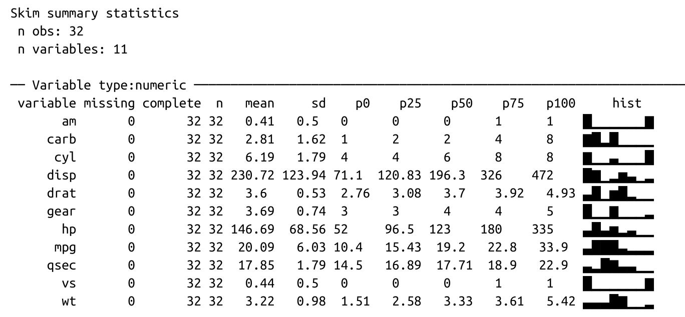
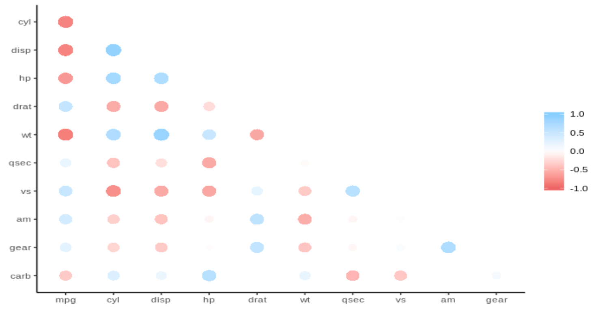

---
output:
  xaringan::moon_reader:
    css: "include/aprender.css"
    seal: false
    nature:
      countIncrementalSlides: yes
      highlightLines: yes
      highlightStyle: github
      ratio: 16:9
resource_files:
  - include
---
```{r, include = FALSE}
library(tidymodels)
library(tidyverse)
library(skimr)
```

---
class: title-slide, middle, center
# Modelar

---
# Analisis rápido con `skimr`

```{r, eval = FALSE}
library(skimr)
skim(mtcars) 
```
```{r, out.height = 400, out.width = 900, fig.align = "center", echo = FALSE}

```

---
# Correlaciones con `corrr`

```{r, eval = FALSE}
library(corrr)
mtcars %>% correlate() %>% corrr::shave()  %>% rplot()
```
```{r, out.height = 400, out.width = 800, fig.align = "center", echo = FALSE}

```

---
class: exercise, middle, center
# Analyzar `vehiculos`
## Ejercicio 6-1
### **Archivo:** 06-1-vehiculos.Rmd

---
class: dark, middle, center
# Introduciendo `tidymodels`

---
class: regular

#`tidymodels`

.left-column[
```{r, out.height = 300, out.width = 300, fig.align = "center", echo = FALSE}
knitr::include_graphics("include/06-tidymodels_hex.png")
```
]
.right-column[
### Conjunto de paquetes para modelamiento y análisis estadístico que comparting la misma filosofía de diseño, grámatica, y estructuras que el `tidyverse`
]

---
class: regular

# Paquetes del `tidymodels`

`rsample` - Tiene una infrastructura para re-tomar **muestras** de datos para que los modelos puedan ser validados

`broom` - Convierte los resultados de **modelos de R en tablas ordenadas**

`yardstick` - Herramientas para **evaluar** modelos

<hr>

`infer` - Una manera moderna de hacer **inferencia estadística**

`recipes` - Contiene multiple funciones para **pre-procesar datos**

`tidypredict` - Traduce algunos algoritmos de **predicción en SQL**

`tidyposterior` - **Compara modelos Bayes** usando muestra re-tomadas

`tidytext` - Para analysis de **datos de texto**

---
class: regular

# Muestra de datos con `rsample`

```{r}
library(rsample)
separar <- initial_split(mtcars)
testing(separar)
```

---
class: regular

# Resultados ordenados con `broom`

```{r}
 summary(lm(mpg ~ wt + cyl, data = mtcars))
```
---
class: regular

# Resultados ordenados con `broom`

```{r}
library(broom)
modelo <- lm(mpg ~ wt + cyl, data = training(separar))
tidy(modelo)
```
```{r}
glance(modelo)
```

---
class: regular

# Evalúe modelos con `yardstick`

```{r}
library(yardstick)
modelo %>%
  augment(newdata = testing(separar)) %>% 
  metrics(mpg, .fitted)
```

---
class: exercise, middle, center

# Modelos con `tidymodels`
## Ejercicio 6-2
### **Archivo:** 06-2-tidymodels.Rmd

---
class: regular

## Use `group_nest()` para agroupar secciones completas

```{r}
mtcars %>%
  group_by(cyl) %>%
  group_nest()
```

---
class: regular

## Use `map()` para crear un modelo por cada agrupación

```{r}
mtcars %>%
  group_by(cyl) %>%
  group_nest() %>%
  mutate(modelos = map(data, ~lm(mpg ~ wt, data = .x)))
```

---
class: regular
## Use `map()` + `unnest()` para ver los resultados en una tabla

```{r}
mtcars %>%
  group_by(cyl) %>%
  group_nest() %>%
  mutate(modelos = map(data, ~lm(mpg ~ wt, data = .x)),
         resultados = map(modelos, glance)) %>%
  unnest(resultados)
```

---
class: exercise, middle, center
# Modelos por segmentos
## Ejercicio 6-3
### **Archivo:** 06-3-modelos.Rmd
